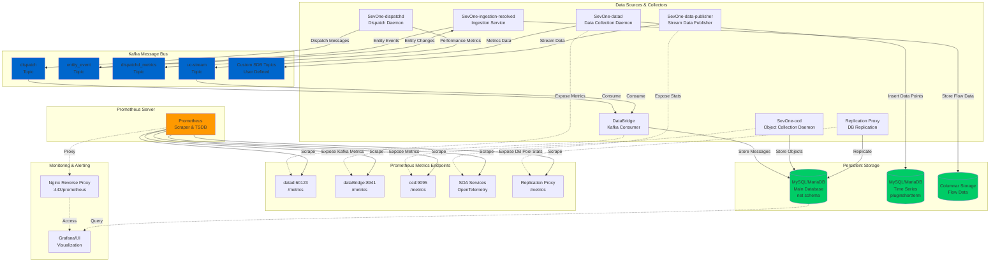

# Metrics Collection Architecture - High Level Design

## Overview
This document describes the metrics collection architecture for the SevOne NMS system, showing the flow of metrics data through various services including Kafka topics, Prometheus, and MySQL/MariaDB.

## Architecture Diagram



## Component Details

### 1. Data Sources & Collectors

#### **SevOne-datad** (Port 60123)
- Primary data collection daemon
- Inserts time-series data into `pluginshortterm` database
- Exposes Prometheus metrics for:
  - `db_insertions_total`
  - `db_failed_insertions_total`

#### **SevOne-dispatchd**
- Dispatches data processing tasks
- Produces metrics to Kafka topic: `dispatchd_metrics`
- Reads from `dispatch` Kafka topic
- Uses xstats framework for statistics collection

#### **SevOne-ocd** (Port 9095)
- Object Collection Daemon
- Validates and processes object data
- Stores in MySQL database
- Exposes Prometheus metrics endpoint

#### **DataBridge** (Port 8941)
- Kafka consumer service
- Consumes from configured Kafka topics
- Exposes Kafka consumer metrics to Prometheus:
  - Consumer group lag
  - Message processing rates
  - Offset information

#### **Replication Proxy**
- Handles MySQL replication
- Exposes connection pool metrics:
  - `sevone_upstream_connection_pool_idle`
  - `sevone_upstream_connection_pool_created`
  - `sevone_upstream_connection_pool_total`

#### **SevOne-data-publisher**
- Publishes processed data to destinations
- Supports multiple Kafka/Pulsar topics
- Filters and enriches stream indicators

### 2. Kafka Topics

| Topic Name | Purpose | Producer | Consumer |
|------------|---------|----------|----------|
| **dispatch** | Dispatching data processing jobs | dispatchd | Multiple consumers |
| **entity_event** | Entity lifecycle events (CREATED, UPDATED, DELETED) | PHP/SOA | Ingestion services |
| **dispatchd_metrics** | Performance metrics from dispatchd | dispatchd | Monitoring services |
| **uc-stream** | Unified collection stream data | datad | data-publisher |
| **Custom Topics** | User-defined SDB destinations | data-publisher | External systems |

### 3. Prometheus Integration

#### Metrics Exporters
Each service exposes a `/metrics` endpoint that Prometheus scrapes:

**Common Metrics:**
- Request rates and latencies
- Error rates and counts
- Queue depths and processing times
- Resource utilization (CPU, memory, connections)
- Kafka consumer lag and throughput

**OpenTelemetry Support:**
- SOA services use OpenTelemetry SDK
- Supports multiple exporters: OTLP (gRPC/HTTP), Prometheus
- Automatic resource detection (host, OS, process)

#### Prometheus Configuration
- Scrape interval: Configurable per service (typically 10s-60s)
- Retention: Configured in Prometheus server
- Access via Nginx reverse proxy at `/prometheus`

### 4. MySQL/MariaDB Storage

#### Database Schemas

**net (Configuration Database)**
- Device, object, indicator metadata
- SDB destination configurations
- User and permission data
- Entity events and changes

**pluginshortterm (Time Series Database)**
- High-frequency metric data
- Short-term retention
- Optimized for fast inserts
- Rotation based on time windows

**Columnar Storage**
- Flow data (NetFlow, sFlow, IPFIX)
- Compressed columnar format
- Long-term historical data

### 5. Data Flow Patterns

#### Real-time Metrics Flow
```
Collector → Kafka Topic → Consumer → MySQL
                ↓
            Prometheus (scrape /metrics)
```

#### Entity Events Flow
```
PHP/API → entity_event topic → Consumers → Database Updates
```

#### Monitoring Flow
```
Service → Expose /metrics → Prometheus Scrape → TSDB → Grafana/UI
```

## Key Design Principles

1. **Decoupling**: Kafka provides loose coupling between producers and consumers
2. **Scalability**: Kafka topics can be partitioned for parallel processing
3. **Observability**: Every service exposes Prometheus metrics
4. **Reliability**: Persistent storage in MySQL ensures data durability
5. **Flexibility**: Multiple Kafka topics support different data types and priorities

## Configuration Files

- **Kafka**: `/root/nms/system/config/kafka/kafka-server.properties`
  - Broker configuration
  - SSL/TLS security
  - KRaft mode (no ZooKeeper)
  
- **Prometheus**: `/root/nms/system/config/nginx/proxy.d/20_prometheus.conf`
  - Nginx reverse proxy configuration
  
- **Services**: Various service-specific configs for metrics endpoints

## Metrics Types

### Application Metrics
- Business logic metrics (devices, objects, indicators)
- Processing rates and throughput
- Error rates and failure counts

### System Metrics
- Database connection pools
- Kafka consumer lag
- Memory and CPU utilization
- Network I/O statistics

### Performance Metrics
- Request/response times
- Query execution times
- Batch processing durations
- Queue wait times

## Security

- Kafka uses SSL/TLS with mutual authentication
- Client certificates required for Kafka connections
- Prometheus endpoints typically on localhost
- Nginx proxy provides authenticated access

## Monitoring Best Practices

1. **Alerting**: Set up alerts on critical metrics (consumer lag, error rates)
2. **Dashboards**: Create Grafana dashboards for key metrics
3. **Retention**: Balance storage costs with historical data needs
4. **Labeling**: Use consistent labels across services
5. **Documentation**: Keep metrics documentation up to date

## Troubleshooting

### High Consumer Lag
- Check Kafka consumer health
- Verify consumer group is active
- Check for processing bottlenecks

### Missing Metrics
- Verify Prometheus scrape targets are up
- Check service /metrics endpoints are accessible
- Review Prometheus configuration

### Database Issues
- Monitor connection pool metrics
- Check for slow queries
- Verify replication is working

## References

- Kafka Inspector Tool: `/root/nms/src/go/kafka_inspector/`
- DataBridge Service: `/root/nms/src/go/dataBridge/`
- Prometheus Configs: `/root/nms/system/config/nginx/proxy.d/`
