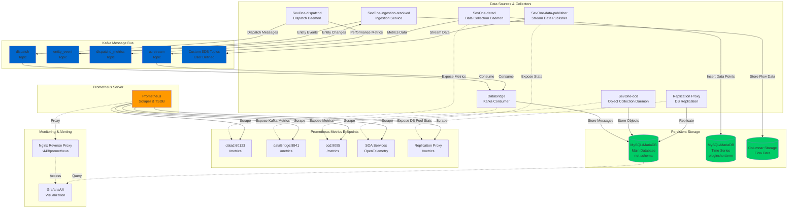

# Metrics Collection Architecture - High Level Design

## Overview
This document describes the metrics collection architecture for the SevOne NMS system, showing the flow of metrics data through various services including Kafka topics, Prometheus, and MySQL/MariaDB.

## Architecture Diagram



## Component Details

### 1. Data Sources & Collectors

#### **SevOne-datad** (Port 60123)
- Primary data collection daemon
- Inserts time-series data into `pluginshortterm` database
- Exposes Prometheus metrics for:
  - `db_insertions_total`
  - `db_failed_insertions_total`

#### **SevOne-dispatchd**
- Dispatches data processing tasks
- Produces metrics to Kafka topic: `dispatchd_metrics`
- Reads from `dispatch` Kafka topic
- Uses xstats framework for statistics collection

#### **SevOne-ocd** (Port 9095)
- Object Collection Daemon
- Validates and processes object data
- Stores in MySQL database
- Exposes Prometheus metrics endpoint

#### **DataBridge** (Port 8941)
- Kafka consumer service
- Consumes from configured Kafka topics
- Exposes Kafka consumer metrics to Prometheus:
  - Consumer group lag
  - Message processing rates
  - Offset information

#### **Replication Proxy**
- Handles MySQL replication
- Exposes connection pool metrics:
  - `sevone_upstream_connection_pool_idle`
  - `sevone_upstream_connection_pool_created`
  - `sevone_upstream_connection_pool_total`

#### **SevOne-data-publisher**
- Publishes processed data to destinations
- Supports multiple Kafka/Pulsar topics
- Filters and enriches stream indicators

### 2. Kafka Topics

| Topic Name | Purpose | Producer | Consumer |
|------------|---------|----------|----------|
| **dispatch** | Dispatching data processing jobs | dispatchd | Multiple consumers |
| **entity_event** | Entity lifecycle events (CREATED, UPDATED, DELETED) | PHP/SOA | Ingestion services |
| **dispatchd_metrics** | Performance metrics from dispatchd | dispatchd | Monitoring services |
| **uc-stream** | Unified collection stream data | datad | data-publisher |
| **Custom Topics** | User-defined SDB destinations | data-publisher | External systems |

### 3. Prometheus Integration

#### Metrics Exporters
Each service exposes a `/metrics` endpoint that Prometheus scrapes:

**Common Metrics:**
- Request rates and latencies
- Error rates and counts
- Queue depths and processing times
- Resource utilization (CPU, memory, connections)
- Kafka consumer lag and throughput

**OpenTelemetry Support:**
- SOA services use OpenTelemetry SDK
- Supports multiple exporters: OTLP (gRPC/HTTP), Prometheus
- Automatic resource detection (host, OS, process)

#### Prometheus Configuration
- Scrape interval: Configurable per service (typically 10s-60s)
- Retention: Configured in Prometheus server
- Access via Nginx reverse proxy at `/prometheus`

### 4. MySQL/MariaDB Storage

#### Database Schemas

**net (Configuration Database)**
- Device, object, indicator metadata
- SDB destination configurations
- User and permission data
- Entity events and changes

**pluginshortterm (Time Series Database)**
- High-frequency metric data
- Short-term retention
- Optimized for fast inserts
- Rotation based on time windows

**Columnar Storage**
- Flow data (NetFlow, sFlow, IPFIX)
- Compressed columnar format
- Long-term historical data

### 5. Data Flow Patterns

#### Real-time Metrics Flow
```
Collector → Kafka Topic → Consumer → MySQL
                ↓
            Prometheus (scrape /metrics)
```

#### Entity Events Flow
```
PHP/API → entity_event topic → Consumers → Database Updates
```

#### Monitoring Flow
```
Service → Expose /metrics → Prometheus Scrape → TSDB → Grafana/UI
```

## Key Design Principles

1. **Decoupling**: Kafka provides loose coupling between producers and consumers
2. **Scalability**: Kafka topics can be partitioned for parallel processing
3. **Observability**: Every service exposes Prometheus metrics
4. **Reliability**: Persistent storage in MySQL ensures data durability
5. **Flexibility**: Multiple Kafka topics support different data types and priorities

## Configuration Files

- **Kafka**: `/root/nms/system/config/kafka/kafka-server.properties`
  - Broker configuration
  - SSL/TLS security
  - KRaft mode (no ZooKeeper)
  
- **Prometheus**: `/root/nms/system/config/nginx/proxy.d/20_prometheus.conf`
  - Nginx reverse proxy configuration
  
- **Services**: Various service-specific configs for metrics endpoints

## Metrics Types

### Application Metrics
- Business logic metrics (devices, objects, indicators)
- Processing rates and throughput
- Error rates and failure counts

### System Metrics
- Database connection pools
- Kafka consumer lag
- Memory and CPU utilization
- Network I/O statistics

### Performance Metrics
- Request/response times
- Query execution times
- Batch processing durations
- Queue wait times

## Security

- Kafka uses SSL/TLS with mutual authentication
- Client certificates required for Kafka connections
- Prometheus endpoints typically on localhost
- Nginx proxy provides authenticated access

## Monitoring Best Practices

1. **Alerting**: Set up alerts on critical metrics (consumer lag, error rates)
2. **Dashboards**: Create Grafana dashboards for key metrics
3. **Retention**: Balance storage costs with historical data needs
4. **Labeling**: Use consistent labels across services
5. **Documentation**: Keep metrics documentation up to date

## Troubleshooting

### High Consumer Lag
- Check Kafka consumer health
- Verify consumer group is active
- Check for processing bottlenecks

### Missing Metrics
- Verify Prometheus scrape targets are up
- Check service /metrics endpoints are accessible
- Review Prometheus configuration

### Database Issues
- Monitor connection pool metrics
- Check for slow queries
- Verify replication is working

## End-to-End Example: Device Metrics Collection

Let's trace how CPU utilization metrics from a network router are collected, processed, stored, and monitored.

### Step 1: Device Configuration
**Component**: MySQL Database (net schema)

A network administrator configures a Cisco router in the system:
- **Device**: Router-NYC-01 (IP: 192.168.1.1)
- **Plugin**: SNMP (v2c/v3)
- **Objects**: CPU (with indicators: Utilization %, 5min Average)
- **Poll Frequency**: Every 60 seconds

```sql
-- Stored in MySQL net schema
Device: id=12345, name="Router-NYC-01", ip="192.168.1.1"
Object: id=67890, device_id=12345, name="CPU", plugin="SNMP"
Indicator: id=11111, object_id=67890, name="Utilization", type="GAUGE"
```

### Step 2: Scheduled Polling
**Component**: SevOne-polld or sevone-device-agent

The polling daemon wakes up every 60 seconds and:
1. Queries MySQL for devices/objects to poll
2. Finds Router-NYC-01 with SNMP enabled
3. Retrieves SNMP credentials and OIDs

```cpp
// SevOne-polld/modules/snmp/SnmpPoller.cpp
sessionHandle = snmpOpenByDevId(database, deviceId=12345);
// Polls OID .1.3.6.1.4.1.9.2.1.58.0 (Cisco CPU)
result = snmpGet(sessionHandle, oid);
cpuValue = 23.5; // 23.5% CPU utilization
```

**Poll Results**:
```
Timestamp: 2025-10-28 14:30:00 UTC
Device: Router-NYC-01 (12345)
Object: CPU (67890)
Indicator: Utilization (11111)
Value: 23.5
```

### Step 3: Data Submission to API
**Component**: Polling Agent → SOA API

The poller packages the data and sends via gRPC to the SOA Data API:

```protobuf
// apiv3.DataRequest
{
  name: "Router-NYC-01",
  ip: "192.168.1.1",
  automatic_creation: false,
  objects: [{
    name: "CPU",
    type: "CPU",
    plugin_name: "SNMP",
    timestamps: [{
      timestamp: 1730125800.0,
      indicators: [{
        name: "Utilization",
        value: 23.5,
        format: GAUGE,
        units: "%"
      }]
    }]
  }]
}
```

```go
// src/go/soa/cmd/soa/modules/devices/data.go
// SOA receives the gRPC call
func (m *Module) Data(ctx context.Context, in *apiv3.DataRequest) {
    // Convert to xstats.Device protobuf format
    device := convertToXStats(in)
    
    // Marshal to bytes
    out, _ := proto.Marshal(device)
    
    // Send to Kafka "dispatch" topic
    m.kafkaClient.SendMessage(out, "dispatch", false)
}
```

### Step 4: Kafka Message Bus
**Component**: Kafka Broker (topic: dispatch)

The data is now in Kafka with SSL/TLS encryption:

```
Topic: dispatch
Partition: 3 (based on device hash)
Key: Router-NYC-01
Value: <xstats.Device protobuf bytes>
Offset: 1,234,567
```

### Step 5: Data Resolution & Enrichment
**Component**: SevOne-ingestion-resolved

The ingestion service consumes from Kafka:

```cpp
// SevOne-ingestion-resolved/IngestHandler.cpp
1. Consume message from Kafka "dispatch" topic
2. Parse xstats.Device protobuf
3. Lookup device_id from name/IP in MySQL:
   - Device name "Router-NYC-01" → device_id = 12345
4. Lookup object_id from object name + device_id:
   - Device 12345, Object "CPU" → object_id = 67890
5. Lookup indicator_id from indicator name + object_id:
   - Object 67890, Indicator "Utilization" → indicator_id = 11111
6. Create DatadInsert message
```

**DatadInsert Protobuf**:
```protobuf
{
  device_id: 12345,
  object_id: 67890,
  current_time: 1730125800.0,
  datapoints: [{
    indicator_id: 11111,
    gauge_value: 23.5
  }]
}
```

```cpp
// Send to SevOne-datad via ZMQ
client->sendDataPacket(dataPacket);
```

### Step 6: Data Storage
**Component**: SevOne-datad

Data daemon receives the ZMQ message:

```cpp
// SevOne-datad/InsertHandler.cpp
1. Parse DatadInsert protobuf from ZMQ
2. Create PollObject for object_id 67890
3. Load object metadata from MySQL
4. For each datapoint:
   - Store indicator value in time-series table
   - Evaluate any synthetic indicators
   - Calculate derivatives/rates if needed
```

**MySQL Insert** (pluginshortterm database):
```sql
-- Table: pluginshortterm.object_67890_table
INSERT INTO pluginshortterm.object_67890_table 
  (indicator_id, time, value) 
VALUES 
  (11111, 1730125800, 23.5);
```

**Prometheus Metrics Update**:
```cpp
// Increment counter
numOfInsertions.Inc();  // db_insertions_total++

// Expose at http://127.0.0.1:60123/metrics
// db_insertions_total{} 1234567
// db_failed_insertions_total{} 0
```

### Step 7: Stream Data Publishing (Optional)
**Component**: SevOne-data-publisher

If SDP is enabled, data is republished to configured destinations:

```cpp
// SevOne-datad/InsertHandler.cpp
if (Global::isSdpEnabled) {
    // Send to Kafka "uc-stream" or custom topics
    pollObject.setKafkaSink(getKafkaSink());
    kafkaSink->publish(streamData);
}
```

```
Topic: uc-stream (or custom destination)
Format: Stream Indicator protobuf
Consumers: External analytics, data lakes, SIEM
```

### Step 8: Prometheus Scraping
**Component**: Prometheus Server

Prometheus scrapes all service metrics every 15 seconds:

```yaml
# Prometheus scrape config
- job_name: 'sevone-datad'
  static_configs:
    - targets: ['127.0.0.1:60123']
  metrics_path: '/metrics'
  scrape_interval: 15s
```

**Scraped Metrics**:
```
# HELP db_insertions_total The number of insertion queries to save data points
# TYPE db_insertions_total counter
db_insertions_total 1234567

# HELP db_failed_insertions_total The number of failed insertion queries
# TYPE db_failed_insertions_total counter
db_failed_insertions_total 0
```

### Step 9: Data Access & Visualization
**Components**: Web UI, REST API, Grafana

Users can now access the data:

**Via Web UI**:
- Navigate to Device → Router-NYC-01 → Object: CPU
- View real-time graph of CPU Utilization
- Data queried from: `pluginshortterm.object_67890_table`

**Via REST API**:
```bash
GET /api/v3/data/indicators/11111/data?startTime=1730125800&endTime=1730129400
Response: [
  {"time": 1730125800, "value": 23.5},
  {"time": 1730125860, "value": 24.1},
  ...
]
```

**Via Grafana**:
- Dashboard queries Prometheus for service health
- Queries MySQL for device metrics
- Shows combined operational view

### Step 10: Monitoring & Alerting

**System Health Monitoring** (Prometheus):
```promql
# Alert if datad insertion rate drops
rate(db_insertions_total[5m]) < 100

# Alert if Kafka consumer lag exceeds threshold
kafka_consumer_group_lag{topic="dispatch"} > 10000

# Alert if failed insertions increase
rate(db_failed_insertions_total[5m]) > 10
```

**Device Metrics Alerting** (from MySQL):
- Alert policy: CPU > 80% for 5 minutes
- Query: `SELECT value FROM pluginshortterm.object_67890_table`
- Action: Send notification, create incident

## Complete Data Flow Summary

```
┌─────────────────────────────────────────────────────────────────────┐
│                       DEVICE METRICS JOURNEY                         │
├─────────────────────────────────────────────────────────────────────┤
│                                                                      │
│  1. Device (Router-NYC-01)                                          │
│     └─> SNMP Poll: CPU OID = 23.5%                                 │
│                                                                      │
│  2. SevOne-polld                                                    │
│     └─> Package as apiv3.DataRequest                               │
│     └─> Send via gRPC to SOA                                       │
│                                                                      │
│  3. SOA API                                                         │
│     └─> Convert to xstats.Device                                   │
│     └─> Publish to Kafka "dispatch" topic                          │
│     └─> Expose metrics at /metrics                                 │
│                                                                      │
│  4. Kafka (dispatch topic)                                          │
│     └─> Store message in partition                                 │
│     └─> Metrics: message rate, lag, size                           │
│                                                                      │
│  5. SevOne-ingestion-resolved                                       │
│     └─> Consume from Kafka                                         │
│     └─> Lookup IDs in MySQL (device, object, indicator)            │
│     └─> Create DatadInsert protobuf                                │
│     └─> Send via ZMQ to datad                                      │
│     └─> Expose consumer metrics at /metrics                        │
│                                                                      │
│  6. SevOne-datad                                                    │
│     └─> Receive via ZMQ                                            │
│     └─> INSERT into MySQL pluginshortterm                          │
│     └─> Optionally publish to Kafka (SDP)                          │
│     └─> Update Prometheus counters                                 │
│     └─> Expose at :60123/metrics                                   │
│                                                                      │
│  7. Storage                                                         │
│     ├─> MySQL: Time-series data (queryable)                        │
│     └─> Prometheus: Service metrics (monitoring)                   │
│                                                                      │
│  8. Access                                                          │
│     ├─> Web UI: Graph of CPU utilization                           │
│     ├─> REST API: JSON data export                                 │
│     ├─> Grafana: Combined dashboards                               │
│     └─> Alerts: Threshold violations                               │
│                                                                      │
└─────────────────────────────────────────────────────────────────────┘

Total Latency: ~2-5 seconds from device poll to database storage
Prometheus Scrape: Every 15 seconds
Data Retention: Configurable per policy (hours to years)
```

## Performance Characteristics

| Metric | Typical Value | Notes |
|--------|--------------|-------|
| Poll Frequency | 60 seconds | Configurable per object |
| Kafka Throughput | 10k-100k msg/sec | Depends on partition count |
| Ingestion Latency | 1-3 seconds | Poll to database |
| Database Inserts | 10k-50k/sec | Depends on hardware |
| Prometheus Scrape | 15 seconds | Configurable |
| Data Availability | < 5 seconds | From poll to UI |

## Error Handling

Each stage includes error handling:

1. **Poll Failures**: Retry with exponential backoff, log to database
2. **Kafka Failures**: Producer retries, dead letter queue
3. **Resolution Failures**: Log unknown entities, auto-create if enabled
4. **Insert Failures**: Increment error counter, alert if threshold exceeded
5. **Scrape Failures**: Prometheus marks target as down, alerts

## References

- Kafka Inspector Tool: `/root/nms/src/go/kafka_inspector/`
- DataBridge Service: `/root/nms/src/go/dataBridge/`
- Prometheus Configs: `/root/nms/system/config/nginx/proxy.d/`
- SOA Data API: `/root/nms/src/go/soa/cmd/soa/modules/devices/data.go`
- Ingestion Service: `/root/nms/src/SevOneNMS/SevOne-ingestion-resolved/`
- Data Daemon: `/root/nms/src/SevOneNMS/SevOne-datad/`

